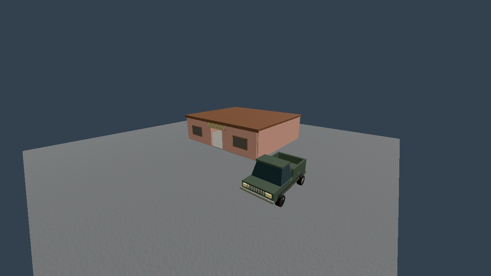

# Family meeting area — 8 October 2026

The Moretti bulk-sale destination previously had no physical meeting or loading
record. Costa Brava now has a modest roadside club at (-7250, -10399), separate
from the unchanged strategic market centre. SiteLayout supplies its footprint,
entrance and loading point; the renderer and checked endpoint lookup use that
same record. Nearby scenery reserves the working plot.

The doorway and interior route remain clear; the walls beside the doorway are
solid. A collision test checks the actual rendered doorway, interior and loading
apron, and validates terrain thresholds, road legs, overlaps and runway clearance.
Classic/generated maps retain unavailable Family endpoints until separately
authored. Props do not represent stock, and no new interaction or economic system
is invented. Legacy truck destinations and simulation anchors remain unchanged.

## Evidence

- Logistics: 28 passed, zero failed.
- Site layout: 9 passed, zero failed, including real physics ray checks.
- Repeated historical loading matrix: **26/99 reachable**, versus 21/99 before;
  five additional journeys use the new Family destination. **73 remain blocked**.
- Ten paired three-hour war seeds: current raw rows and aggregates match the
  prior review baseline exactly. See [raw results](../sim-results/family-war-2026-10-08.json).
- [Existing read-only audit](../tools/logistics_routes.gd) preserves the same historical
  99 endpoint pairs and never dispatches an order or changes money/stock.
- The complete regression of the physical/simulation implementation passed
  **1,063 tests, zero failed** (351 / 362 / 350). After the non-colliding sign,
  windows and fascia pass, all nine site-layout tests passed again. Three export
  checks passed and isolated desktop smoke reported `SMOKE OK`; no script or
  parse failures were found. Shutdown cleanup diagnostics remain separate.

The image is an isolated geometry preview with a period truck; it is not a human
world walkthrough. A fresh in-world/exported walkthrough remains outstanding.
The remaining blocked routes are not bypassed and truck/squad migration remains
pending. Intentional island and La Selva remoteness remains unchanged.
