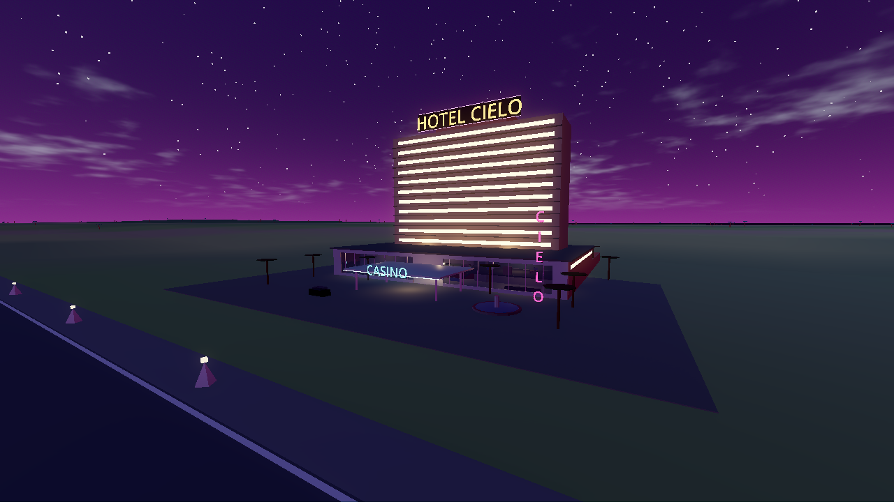
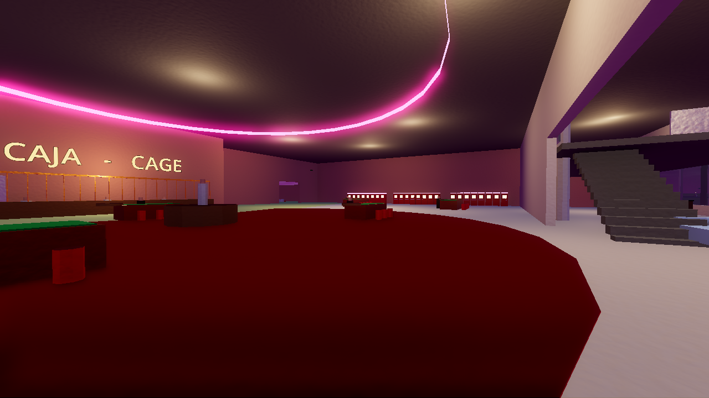
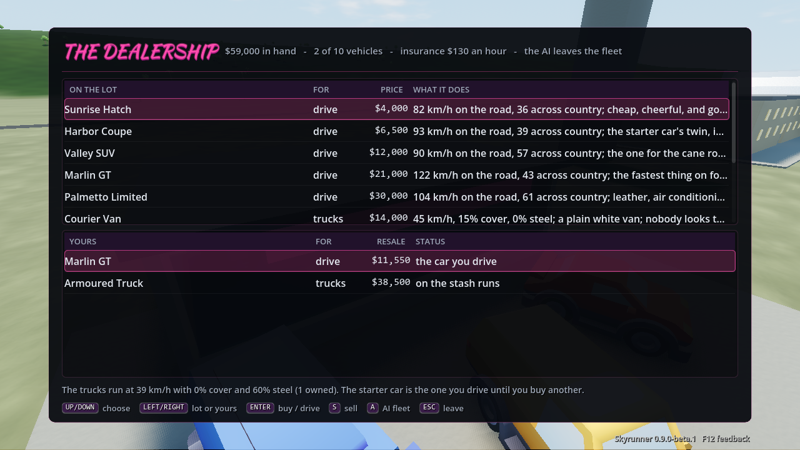

# The Skyrunner guide: roles, mechanics and controls

One document for playing the game: who you can be, what every system does, and every key. It is written for a
player. For *why* things work as they do, see [DESIGN.md](DESIGN.md) (the section numbers below point there); for the
numbers behind the balance see [BALANCE.md](BALANCE.md). In the game, **F1** shows the flight and on-foot keys.

Contents

1. [The game in one page](#1-the-game-in-one-page)
2. [Starting a game](#2-starting-a-game)
3. [The roles (seats)](#3-the-roles-seats)
4. [Controls](#4-controls)
5. [Mechanics](#5-mechanics)
6. [Playing together](#6-playing-together)
7. [Quick reference](#7-quick-reference)

---

## 1. The game in one page

It is the Caribbean coast, 1979 to 1989. You fly a small aircraft. The work is honest at first (passengers, cargo, mail
between bush strips), then it is not: **hot jobs** pay several times more and put the police on you.

Two sides play against each other, and any seat nobody takes is played by the AI:

- **The organisation** (the runners): a pilot, a co-pilot who loads and kicks the bales, spotters on the strips, a boat
  for airdrops, and, as the business grows, a boss, a lieutenant with soldiers on the streets, and a fixer. It earns from
  loads, buys stash houses and crews, fights Los Cuervos for the streets, deals with the Family, the Company and the
  General of Isla Soberana, and tries to stay out of court.
- **The task force** (the law): a controller at the radar and dispatch desk, police pilots, the Coast Guard cutter, a chief
  who holds the budget, a patrol commander with narcotics squads, an analyst who reads the tips and an undercover agent.

Everything is physical. Weight and balance decide whether you take off. Product and cash sit in stash houses until a truck
or an aircraft moves them. The police see you only through radar, radio, tips and eyes, never through the sim's secrets.

**The loop:** take a job, load, fly it, deliver, spend the money (aircraft, gear, crew, stash works), and keep the heat
down. **The goal** depends on the mode: in the story, each chapter has measured goals (some chapters add optional side goals that pay a bonus) and the last is *Last Flight* (1988: ninety grand,
a cold case, and the long way out); in open and sandbox play, make the organisation as big as you can; on the law side, shut it down.

---

## 2. Starting a game

Run the game with no arguments and the **lobby** opens. It sets the same things as the command-line flags
([README](../README.md#command-line)).

| Choice | What it is |
|---|---|
| **Solo** | You are the pilot; the AI plays every other seat. |
| **Flying lessons (Costa Brava)** | Four flying lessons on Costa Brava: mail runs, a favour for Manny, airdrops, the long legs. |
| **Co-op: friends crew for you** | You host; friends take the co-pilot, spotter, boat, boss, lieutenant or fixer seats. |
| **Versus** | Humans on both sides; the AI fills the empty seats. |
| **Unlocks: Story / Open** | *Story* (the default): twelve chapters, 1979 to 1988, each opening part of the game. *Open*: every faction and system from the first minute, and a $10,000 float. |
| **Map** | Costa Brava, the city coast (default); or a generated island by positive seed. |
| **Tutorial box** | Lessons that finish when you do the thing, and tips when something new happens. |
| **Multiplayer** | Host a game with a waiting room, or look for games on your network (also **F4** in game). |

**The story, in brief.** *Square Grouper* (1979, grass and stash houses) → *The Connection* (1980, logistics; the
Colombians call) → *Blotter* (1980, the Sunrise Collective: acid for grass, and the task force takes the lab) → *Cocaine Cowboys* (1981, cocaine, Los Cuervos, the street war) → *Family Business* (1982, the
Morettis) → *The Task Force* (1983, the federal court) → *Isla Soberana* (1984, the island) → *The House* (1984, the Family's casino) → *The Company* (1985, the
Agency) → *Kingpin* (1986) → *The Hearings* (1987, keep the case cold) → *Last Flight* (1988). A chapter's goals are measured by the systems themselves (pounds landed, dealers on corners,
cash home). A faction already gone before you meet it does not strand a chapter.

**Saving.** Press ESC for the pause menu: resume, save, load, settings, quit to the lobby or the desktop. A save is written
parked at an airfield and keeps the whole world: the stash houses and what is in them, the crew, the court case, the
squads of every side, the Family, trade and prices, the island, the Company, the arsenals, the HQ season. Trucks, boats and
jobs in flight are not kept.

---

## 3. The roles (seats)

There are fifteen seats. Each is an AI until a human takes it. In the waiting room and in the seat list you see who holds
what; leave a seat and the AI takes it back (a dropped connection holds the seat for 30 seconds).

### The organisation

| Seat | What you do | What you see | Interface |
|---|---|---|---|
| **Pilot** | Flies the aircraft. Also does everything on the ground the other seats do, when nobody else does. | The 3D world, the HUD, the radar-detector light | 3D (the main game) |
| **Co-pilot** | Loads the aircraft (twice the pilot's speed), pumps ferry fuel, kicks bales out over drop zones, runs the radio scanner, calls the boat, hires spotters | Flight, Load and Jobs tabs over live tiles; the map | 2D desk (or a 3D right seat with `--seat3d`) |
| **Spotter** | Watches one strip from the ground and reports police and roadblocks near it; can relocate (60 s) | Police units within 5 km of the watched strip, a little late | 2D desk |
| **Boat captain** | The go-fast: waits at the rendezvous, picks bales out of the water, runs for the cove | The surface picture around the boat | 2D desk: right-click the map to send it |
| **Boss** | The organisation's HQ: nightly orders (fronts, laundering, bribes, crews, routes, gear), the season's books | The HQ board; with a ground war, the squads (Q) | 2D desk |
| **Lieutenant** | The soldiers on the streets: raise squads, give orders, hold the corners; also the Family, the island, the hiring hall, logistics | The squad map, the armoury, who holds each market | 2D desk |
| **Mechanic** | Keeps the aircraft flying: repairs in the field (quicker and cheaper than a hangar), reads the engine and airframe in real numbers, haggles for the farmer's fuel | The true condition, the cost of the work, the repair under way | 2D desk |
| **Fixer** | The business between flights: books and drops jobs, buys gear, hires spotters and crew, sees the Family, the lawyer and the buyers, watches the heat and the money | The job board, the payroll, the pilot's case, the street | 2D desk |

### The task force

| Seat | What you do | What you see | Interface |
|---|---|---|---|
| **Controller** | The radar and dispatch desk: launch and send helicopters, interceptors and cutters, set radio encryption, raise the aerostat, jam, raid stash houses, prosecute | Radar tracks (position noise, no identity for aircraft that don't squawk), tips, your units | 2D desk |
| **Police pilot (interceptor)** | Flies a helicopter or jet in 3D and makes the visual ID | Out the window; other aircraft only while your unit can see them | 3D seat |
| **Coast Guard cutter** | Hunts boats and seizes floating bales | Surface radar | 2D desk |
| **Chief** | The task force's HQ and budget: patrols, recruitment, wiretaps, audits, aerostat, encryption, funded units | The HQ board | 2D desk |
| **Patrol commander** | The narcotics squads on the streets: stakeouts, tails, raids, sweeps | The squad map | 2D desk |
| **Analyst** | The tip desk: every tip waits for you before dispatch sees it; check it, forward it or bin it | The tips, where they came from, how old they are and what the check made of them | 2D desk |
| **Undercover agent** | Plants a tracking beacon on a runner's aircraft while it sits on the ground | Where the aircraft is parked, the odds, your cover | 2D desk |

**What the AI does when a seat is empty.** The AI pilot flies the career (`--watch` shows it); the AI controller launches
on tips and tracks; the AI boss, chief, lieutenant and patrol commander run their HQs and squads; the AI analyst forwards
every tip at once; nobody plants beacons (the law upgrade *undercover* still leaks destinations by itself). With a human
boss or chief the AI steps back from that HQ; with a human lieutenant or patrol commander, the AI stops commanding that
side's squads.

**Which modes have which seats.** Solo: pilot. Co-op: pilot, co-pilot, spotter, boat, boss, lieutenant, fixer, mechanic. Police (the
task-force desk against AI runners): controller, police pilot, cutter, chief, patrol, analyst, undercover. Versus: all of
them. The Tutorial campaign: pilot, co-pilot, spotter, boat.

---

## 4. Controls

Every flight key and gamepad button can be rebound (**F8**). The keys below are the defaults.

### 4.1 Pilot: flying

| Key | Does |
|---|---|
| W / S or ↑ / ↓ | Pitch |
| A / D or ← / → | Roll |
| Q / E | Rudder and nosewheel steering |
| R / F or PgUp / PgDn | Throttle (hold; a tap moves a few per cent) |
| Z / X | Ramp the throttle to full / to idle (press twice for instant) |
| G / T | Flaps down / up |
| [ / ] | Pitch trim |
| B or Space | Brakes |
| Y | Mouse yoke on / off (mouse position is the stick) |
| C | Camera: chase, cockpit, tower |
| M | The big map (the island chart); the round radar in the corner turns with your nose, `+` / `-` change its range, Shift+M holds north up |
| P | Pause |
| N | Transponder on / off |
| 7 | Squawk code: 1200 (VFR), then 7700, 7600, 7500 |
| U | Autopilot: first press holds heading and altitude; second routes you to an airfield (low for a hot load, direct at cruise otherwise); third turns it off |
| K | Kick a bale (over a drop zone, below 130 kt) |
| O | Call the boat (Shift+O: the one-second codeword, harder to direction-find) |
| V | Ferry fuel pump on / off |
| I | Push the aircraft round (when stopped) |
| Enter | Confirm / continue |

**Flight assist** (ESC menu) keeps the wings level and the pitch held when no key is down, and makes taps gentle. A
joystick, gamepad, yoke, throttle quadrant and pedals (with toe brakes) all work; bind each analogue axis by moving it, with
invert, deadzone and expo (**F8**).

### 4.2 Pilot: on the ground

| Key | Does |
|---|---|
| J | The job board at this strip |
| L | The load planner and the fuel (pick every item's station; the fuel slider has 25 / 50 / 75 % / full / "route + 30 min") |
| H | The hangar: aircraft, gear and services; LEFT / RIGHT turns to the upgrade trees |
| Tab | Get out of the aircraft (when parked) / climb back in |
| Shift+W | Manny Ortega's hiring hall |
| Shift+H | Logistics: product and cash in the stashes, trucks, cash bags |
| Shift+B | Benny Ruiz and the buyers |
| Shift+L | Your lawyer (when arrested) |
| Shift+F | The Family: the offer, your man's read on it (1–4 answer, Enter go on) |
| Shift+T | The phone from the cockpit: every number you have (a new one is announced and marked NEW) |
| Shift+C | Ring the Sunrise Collective (acid for grass) |
| Shift+Y / Shift+N / Shift+P | Take / turn down the newest Family offer / pay the tribute |
| Shift+G | The General's aide on the island frequency |
| Shift+U / Shift+I | Four mules on the airliner / a container on the freighter |

In menus: ↑ ↓ choose, ← → change, Enter does it, **A**, **+/−**, **F**, **G**, **Q** are the menu's own keys (shown in its
footer, which is also clickable), ESC closes.

### 4.3 On foot

| Key | Does |
|---|---|
| W A S D, Shift, Space, mouse | Walk, run, jump, look |
| E | Use what you face: job board, fuel desk, hangar, the boss's desk, the map table |
| F | Torch |
| T | The phone (below) |
| 1 – 4 | Draw a pistol / rifle / machine gun / RPG from the armoury (with a ground war) |
| H, R, left button | Holster, reload, fire |
| I | Your pack: spare guns, rounds, medkits (24 kg; over 12 kg you slow down) |
| 5 | Use a medkit |
| Z / X / C / V | Squad orders: hold / come to me / charge / fall back (the nearest of your squads) |
| M | The minimap |
| F2 | Move the time of day on three hours |
| Esc | Release the mouse, then the pause menu |

**The phone (T)** rings whoever you would otherwise have to walk or fly to: Manny's hiring hall, the buyers, your lawyer,
the Family, the General's aide, the desk (the boss's orders, and the squads when there is a war), **the track** (races), **the
collectors** (the rackets), dispatch (logistics) and **a taxi** (a ride, fare up front, to the aircraft, the desk, the job board,
the hangar or a stash house). Only the systems switched on appear.

**The car.** A parked car stands beside the aircraft. **E** at it gets you in; W / S throttle and brake, A / D steer, Space
handbrake, **E** to get out. The road is fast; anywhere else is a crawl. In the car: **R** radio on / off, **, .** (or **[ ]**)
tune. The radio plays real broadcasts from 1979–86 from Miami and around the Caribbean, always on the air by the sim clock.
Your own recordings go in `user://radio/`.

### 4.4 Everywhere

| Key | Does |
|---|---|
| F1 | Help (the key list) |
| F2 | Advance the time of day |
| Ctrl+F2 | Developer access overlay: functional footprints, entrances, approaches, loading areas, connector candidates and collision shapes |
| F3 | Hand the aircraft to the AI (so you can sit at another desk) / take it back |
| F4 | The multiplayer menu: games on your network, the table (mute, remove, seats, chat), voice settings |
| F6 | Performance overlay |
| F7 | The radio on / off in the aircraft (`,` and `.` tune): the same real 1979-86 broadcasts as the car's, on one dial |
| F8 | Controls and settings: rebind keys and axes, read-aloud, the colour-safe palette |
| F9 | Screen filter: off, VHS, colour-blindness simulations |
| F10 / Shift+F10 | Skip the tutorial step / tutorial on or off |
| F12 | Feedback bundle (a zip of what happened, to send back) |
| \` (backtick) | Push to talk on your side's net; Shift+\` talks to the whole table |
| Esc | Pause menu (or close the open menu) |

### 4.5 The desks (2D seats)

Every desk has a map on the left and the seat's own panel on the right. Every key has a clickable key cap in the footer.
**Esc** asks before leaving the seat. There is a chat line to your side on every desk.

**Co-pilot.** 1 / 2 / 3 switch the Flight, Load and Jobs tabs. **K** kick, **V** pump, **O** call the boat, **B** the
codeword, **T** auto-kick. Load tab: ← → move the item, **A** loadmaster, **+ / −** fuel 10 %, **F** fill the ferry tank.
Jobs tab: **Enter** accepts or drops. Click a strip on the map to hire a spotter there. **C** the Family, **W** the hiring
hall, **L** the lawyer, **M** the buyers, **Y / N / P** Family offers and tribute (when those systems are on).

**Spotter.** ↑ ↓ pick a strip, **Enter** sends the spotter (60 s), or click a strip.

**Boat captain.** Right-click the map: the go-fast goes there.

**Boss.** The order list: ↑ ↓ choose, ← → set it (which front, whom to bribe, how many crews, which zone), **Enter** issues. Hot
keys: **1** launder, **2 / 3 / 4** buy a laundromat / car lot / marina, **P** operational security, **C** counter-intelligence,
**Y** loyalty, **Z** lie low, **U** upgrade, **G / H** scanner / detector, **L** lawyer, **K** crews (or logistics when the
street trade is on), **D** decoys, **R** route. **Q** swaps the orders for the squads (with a ground war). The
**Ready for tonight** button ends planning.

**Lieutenant.** ↑ ↓ choose a squad (or click), right-click the map to send it (a stash: guard it; an enemy squad: attack it;
elsewhere: patrol / hold the street); **Tab** next squad; **A** ambush here, **M** melt away, **H** hold, **D** disband;
**F / V / K** raise a foot squad / a car / a truck. Also **C** the Family, **G** the General's aide, **U / I** mules /
container, **L** the pilot's lawyer, **W** the hiring hall, **K** logistics.

**Mechanic.** ↑ ↓ choose the part (engine, airframe), **Enter** repairs it, **B** both, **S** stops the work, **I** inspects (says the real numbers aloud), **F** adds 10 % fuel.

**Fixer.** ↑ ↓ choose a job, **Enter** takes or drops it; **W** the hiring hall, **C** the Family (with **Y / N / P**), **L** the
lawyer, **M** the buyers, **K** logistics; **G** scanner, **H** radar detector, **F** ferry tank, **S** a spotter at this strip.

**Controller.** Click a unit to select it (**Tab** for the next), then click a track to dispatch it, or right-click a spot.
**H / I / C** launch a helicopter / interceptor / cutter (at the mouse); **R** recall; **E** encryption on / off;
**B** the aerostat up / down; **G** coverage overlay (blind below 150 / 500 / 1500 m); **T** tactical channel; **J** a
jammer van (at the mouse or the latest DF fix); **X** raid the nearest known stash; **V** investigate the Agency; **O** a RICO
case against the Family; **L** airport crackdown; **P** port inspections; **A** a deal for an arrested worker; **U** the
upgrade trees. With a court case open: **N** no bail, **W** a witness's immunity, **K** bank records, **D** a conspiracy
count, **Y** a plea offer. With the street trade: **M** sweep the market under the mouse, **T** follow the money.

**Chief.** The order list as for the boss: **A** aerostat, **R** recruit, **W** wiretap, **U** audit, **S** internal-affairs
sweep, **E** encryption, **P** press, **H / I / C** fund helicopters / interceptors / cutters (cycles 0–3), **Z** patrol zone;
**Q** squads.

**Patrol commander.** The squad controls as the lieutenant's, with **A** for a checkpoint, plus **O** the RICO case and
**M** a street sweep. Right-click a known stash: stake it out, or raid it when it is known.

**Police pilot.** **Space** claims an interceptor, **H** a helicopter, **X** hands the unit back to the AI. Then W A S D fly,
**R / F** throttle, **Q / E** rudder, **B** brake, **C** camera.

**Analyst.** ↑ ↓ choose a tip, **V** verify it (45 s), **F** forward it to dispatch, **X** bin it.

**Undercover agent.** **P** plants the beacon.

---

## 5. Mechanics

### 5.1 Flying, weight and balance (DESIGN 5)

Five aircraft, each with its own flight model (propeller torque, stalls, wind, gusts, rain). Every item has a weight and sits
at a **station** with an arm, so the centre of gravity moves as you load. Too heavy: a long roll and a weak climb. CG too far
aft: pitch-up and stall. Too far forward: you cannot flare. The load planner draws the take-off and zero-fuel CG on the
envelope and shows the take-off roll against the strip. Short bush strips pay more and punish a bad load. Fuel is weight
and has a price that moves with the economy; a ferry tank (and the pump, V) lets you cross the long legs.

Loading takes time: the ground crew moves one item at a time (the co-pilot, twice as fast). Landings are judged: a hard
touchdown or an overrun can wreck the aircraft.

### 5.2 Jobs

The **job board** at each strip lists work: passengers and cargo for money, **hot** contraband that pays far more, **airdrops**
to a boat, **gun runs**, and fuel drums (fly them to a strip to start a cache). A job shows its pay, weight and distance and,
for a strip, the estimated landing roll against the strip length, so a trap shows red. Hot jobs and gun runs raise **heat**.

### 5.3 The police and the heat (DESIGN 3, 4)

The task force never sees your true position. It has **radar sites** (each turns at its own rate; detection falls with range
and aircraft size), a **tethered aerostat** with a huge line of sight, **direction finders** on your radio calls, **tips**,
and eyes (patrols, spotters of its own).

- **Altitude and terrain.** Below a site's floor (about 45 m AGL plus 9 m per km of range) and behind terrain you do not
  show. Low over rough sea or in rain the clutter hides you; an MTI notch makes crossing the beam or flying slow cancel you
  as clutter.
- **The transponder.** Off: no identity, but an unidentified primary track builds suspicion quickly, and a squawk that
  *vanishes* on radar is a red flag. On: you look like a charter and are tracked the whole time you are in coverage. The
  emergency codes 7700 / 7600 / 7500 get a response from Center.
- **Suspicion, wanted and the bust meter.** Suspicion rises with tips, odd tracks and fuel purchases; wanted stars with what
  they know; police within a few hundred metres for a few seconds fills the bust meter. A bust is a court case (5.14).
- **Your counters.** The **radar detector** shows who is painting you and from where (with the upgrade, a bearing). The
  **scanner** hears police dispatch (the **encryption** order turns it into static at the price of slower dispatch). Keep
  radio calls short or use the codeword; every transmission gives a bearing, two stations give a fix.
- **Weather and the moon.** A nightly forecast (right about three times in four). Cloud, rain and a dark moon hide you; storms
  ground helicopters and the aerostat and more than double crash risk; sea fog (about three nights in ten) cuts sight to a
  few hundred metres, grounds helicopters above 75 %, and does nothing to radar.
- **Pattern of life.** The analysts learn your routine: repeat a route and they expect you (up to +45 % detection). Mix them.

### 5.4 Airdrops, bales and boats (DESIGN 5.3)

Landing with the goods is for amateurs. Fly low and slow over the go-fast boat's mark and **kick** bales (the co-pilot, 2 s a
bale; the pilot on autopilot, 4 s; not above 130 kt). A bale is ballistic and floats if it lands on the sea. The boat collects
bales within 40 m (5 s each), runs for the cove and the job pays per bale delivered. **Calling the boat** on the radio helps it
find you and helps the task force find you; the codeword (Shift+O) is quieter.

### 5.5 Stash houses and logistics (DESIGN 22)

Eight stash houses (a farm barn, a mangrove shack, Warehouse 7, a lock-up in Barrio Chino, a jungle camp, a quarry shed, a
boathouse, a hillside villa). A stash run lands at a nearby strip and a truck brings the load in while you fly on. Product
and cash are *somewhere*: loads sit in a stash, a dealer sells only what is in a stash in his own market, street money piles
up where it was made. Wages, lawyers and upgrades come out of the club's safe, so cash must be **trucked home** or flown as
cash bags (about $4,500 a pound, and evidence if you are busted). Bulk lots go by truck to the buyer's meet and the money rides
back. The growers and the connection want cash on the strip.

Every truck can be stopped at a roadblock (all of it forfeited), hijacked by Los Cuervos, escorted, or talked past by a good
driver. A raid takes the stash's product and cash. The AI boss runs regular pickups. **Rounds**: one truck can take the cash from
several stashes (or drop product at several) in one trip. **Fuel** for the hired fleet is paid for and trucks stop to refuel.
The logistics view (**Shift+H**, or **K** at a desk) colours trucks by cargo (cash green, product white, guns red, a buyer's
lot amber); each truck has an **Escort** button.

**Stash works** (bought in the logistics view): a **hidden vault** (two levels; a level-2 vault saves 70 % of a raided house's
product and cash) and a **guard post** (two levels; halves a delivery's heat penalty and cools the house faster).

### 5.6 The street: markets, trade and dealers (DESIGN 18, 19)

Every good has a price in each market (the town and three zones) that moves with rival turf, police presence, seizures,
your own deliveries (a glut where you sell), fuel, storms and the news. Under the prices each drug has supply and demand per
market, a distribution network that can break, and an upstream source. **Arrests, raids, seizures and informants** dry corners;
rival containers flood the docks; the Family's fall takes the gun fence.

You start the way the 1970s smugglers did: cheap bulky **grass** into your stash. **Dealers** (hired from Manny) sell it on
the corners against Los Cuervos' dealers and get picked up by police. **Bulk buyers** (Shift+B, Benny Ruiz) take lots: the
Morettis, the Company, and (rifles only) Los Cuervos, each arming a different side of the wars. **Cocaine** opens once the
Colombians call (you have moved enough grass). The law sweeps corners and follows the money.

### 5.7 Hired hands (DESIGN 17)

Both cartels run on a **payroll**: soldiers crew squads (no soldiers, no squad); drivers take trucks past checkpoints;
mules fly the island run; lookouts see raids coming; an accountant cleans or skims the books; contract pilots fly runs of
their own. Hire from Manny's hall (Shift+W; skill shows, loyalty only as a hint). **Payday every 10 minutes**: unpaid wages
mean skimming, walking off, or calling the task force. An arrested worker gets a case of their own: a lawyer keeps them
quiet, the prosecutor's deal makes them talk.

### 5.8 The ground war (DESIGN 11, 26)

Soldiers, Los Cuervos' crews and narcotics squads on foot, in cars and trucks, on the city's roads. A firefight is
Lanchester's square law on weapons, cover and nerve. The organisation and Los Cuervos fight as guerrillas (ambushes,
hit-and-run, melting into the barrio, the jungle and the mangroves, decoy cars); the task force fights like a narcotics
unit (stakeouts, tailing a truck home, controlled buys, a cordon before the raid, checkpoints, saturation patrols, SWAT; it
does not fire first and prefers arrests). Who holds the streets moves the markets and, night by night, Los Cuervos' turf.

**Veterans.** Squads learn from fights they survive: Green, Blooded, Veteran, Elite, each with more fire per man, steadier
nerve and dearer upkeep. **Field orders** on foot (Z X C V) give the nearest squad of yours a quick order.

**Guns and arsenals.** The organisation, the task force and Los Cuervos each hold weapons (pistols, rifles, machine guns,
RPGs) and ammunition. Gun runs bring crates in: sell them at the street price or keep them for your soldiers. Whatever the
police seize (a busted load, a stopped truck, a raided stash, the guns off arrested men) arms their patrols. The armoury is in
one place and can be moved.

### 5.9 Rackets and prisoners (DESIGN 27)

Streets you hold pay **tribute** (a market where you hold over half the street pays up to $160 a round at full control,
scaled by renown), collected every ten minutes. Each market's terms are **fair**, **squeeze** (double or better, but the
street resents it) or **off** (Enter in *the collectors*, from the phone). Rival squads you rout leave **prisoners**: ransom
them (**A**), put them on your payroll (**F**) or let them go (**G**), or a few escape. A hold on a market, not a count of
squads, is what pays.

### 5.10 Renown (DESIGN 25)

A score of how big your name is, earned by loads delivered, island customs cleared, raids foiled, a jury that lets you walk
and sales; lost at half weight by busts, crashes and raids. Five tiers improve the hiring hall's candidates, the bulk buyers'
prices and how closely the task force watches you. The phone shows your title and the next threshold.

### 5.11 The arena (DESIGN 29)

Two courses at whatever strip you are at: a **street race** in the car (a loop on the roads, up to about 10 km, a gate every
500 m) and an **air circuit** (six gates, 2.5 km from the strip, 180 m up, 110 m tolerance). Open **the track** from the phone
and press Enter to enter. The entry is a tenth of the prize. Take the first gate to start the clock, then the gates in order
(a glowing ring with a beam, the next one dim). A field of four rivals runs at par ×0.85 to ×1.35: first place takes the whole
prize, second half, third a quarter, and renown +6 / +3 / +1. A course pays once an hour. You are out, and the fee is gone, if
you leave the car, land from the circuit or take three times par. A HUD chip shows the gate, the clock and par.

**The book.** In the track menu **B** cycles your stake ($0 / 100 / 200 / 300) and **N** chooses a *win* (pays 3×) or a *place*
(top three, 1.5×). The stake is lost if you drop out, and the book is shut on a course that has paid within the hour.

### 5.12 The Family (DESIGN 14)

A (fictional) Cosa Nostra family whose help might be a trap: a loan, laundering, the docks' union, a gun fence, a crew of
soldiers, a lawyer. Every offer comes with your man's read on it (right about four times in five). The Family levies a street
tax when you are rich, sells to Los Cuervos too, and a RICO case with a rat in it turns it against you. Sit down with Sal
Moretti (Shift+F in the cockpit, **C** at a desk): hear the offer, press him for a second read, take it or leave it, pay or
stall the tribute.

### 5.13 The Company, and Isla Soberana (DESIGN 13, 15)

**The Company** runs a covert arms pipeline (cocaine north, guns south, as in the Contra era). Fly for it and it protects you:
busts quashed from Washington, checkpoints told to wave your trucks through, protected return legs. Every quash leaves a trail;
the task force can dig (**V** at the controller's desk) and when it is exposed the hearings end it. It plays a double game too:
under pressure it gives your name away, lets the DEA have a flight, or "mails" your pay.

**Isla Soberana** is an island republic over the southern horizon (SOB). Product is cheap there; get it home by air, as mules
on the airliner (Shift+U) or in a container on the freighter (Shift+I). Customs' odds depend on both sides' perks (bought
handlers, forged papers and false bottoms against dogs, profiling, X-ray, crackdowns). The task force cannot follow past the
line; the General sells passage past his MiGs until a purge closes the island. His aide meets you on the ramp, or on the radio
(Shift+G).

### 5.13b The Hotel Cielo (DESIGN 40)

The Family's casino on Isla Soberana: a stake in the house (tenths, up to 40 %), the cage (street cash in, clean cheques out, for a
fee, and it cools your case), the General's skim and favours, a rival casino, the task force's wiretaps, audits and raids, and
in the end a revolution you have twenty minutes to get out of. Ring Lenny Vance with **Shift+K** in the cockpit, **X** at the boss's,
lieutenant's, co-pilot's and fixer's desks, or from the phone. The controller and the chief press **F** for the casino file. It is
the story's chapter *The House* (1984).

You can also walk in. Land at Aeropuerto Soberano, press **TAB** to get out and walk 150 m along the apron to the hotel
(a pink-and-white block under a twelve-storey slab, its sign visible from the runway). Inside: the lobby and bar, a mezzanine
office (**E** at Lenny's desk is the same conversation as the phone call), the cage (**E** to talk: cash, chips, the Family's
account), and the floor with three roulette wheels, four blackjack tables, two craps tables, a baccarat salon and the slot banks.
**E** at a table sits you down at its screen: **+ / -** change the stake ($5 to $500), **ENTER** is the main move, and the hints
along the foot say the rest (roulette: LEFT/RIGHT picks the bet, **S** spins; blackjack: **A** hit, **S** stand, **D** double;
craps: **P** pass, **D** don't pass, **O** odds, **ENTER** rolls). The odds are the real ones (DESIGN 41), and the cards, dice, reels and the roulette ball are drawn on the felt. Out the back is the
cabaret courtyard under its four concrete arches. When the house is dark, shut by the commission, in revolt or seized, the
lights go out and the door is boarded.

### 5.13c The dealership (DESIGN 43)

Open from the phone (**The dealership**) or press **E** at the glass showroom beside the terminal at a hub or regional airfield. The lot lists
five cars for you to drive (the hatch, the coupe, the SUV, the Marlin GT, the Palmetto Limited) and five trucks for the stash runs (a courier
van, a steel box truck, a fast van, an ambulance conversion, an armoured truck). **ENTER** buys; **LEFT/RIGHT** moves to your own vehicles, where
**ENTER** makes a car the one you drive and **S** sells (55 % back). Your trucks set the speed, the cover and the steel of every stash run.
**A** lets the AI manage the fleet. The boss and the fixer press **V** at their desks to ring the dealer. Vehicles cost insurance by the hour. It opens with logistics in the story.

### 5.13d The Sunrise Collective (DESIGN 44)

Up in the hills a commune of chemists, led by Nico Cozz (an invented character), makes blotter acid and wants grass for the festival and campus
circuit. Grass comes cheap from the bush strips: land at one, take the "Our own grass" job off the board (J) and fly it into a stash house. Then ring Nico. Ring them with **Shift+C** in the cockpit, **J** at the boss's and fixer's desks, or from the phone. A van calls at your fullest stash
and swaps the grass for sheets of acid (about 2.4 a hundredweight, better as they trust you); you sell the sheets back through their circuit
(about $260 a sheet). It pays roughly 40 % better than selling the grass to the Family, but the lab is raided now and then and goes to
ground for hours, and every sheet adds a little to the task force's case. Festivals make the circuit hungry; a campus crackdown makes it
quiet. It opens with the story's 1980 chapter.

### 5.14 The court (DESIGN 16)

A bust is a federal case. **Charges** (possession, trafficking, firearms, conspiracy). **The bail hearing**: post it all, buy
a bond, or sit in custody; the prosecutor calls a rich pilot or a friend of the island a flight risk. **Lawyers**: the public
defender, a Calle Ocho attorney, a Brickell Avenue drug lawyer, or the Family's man (who may be working for the other side).
**Motions**: suppress an illegal search, discovery, continuances. **Off the books**: lean on a witness, pay a judge (either can
become obstruction). **The outcome**: a plea, a cooperation deal that sells out the organisation, or a jury. **The sentence**:
mandatory minimums after 1986, the aircraft forfeited, time inside to wait out, and one appeal. Skip bail to the island and you
are a fugitive. The task force prosecutes from the controller's desk (N W K D Y) or the AI does. Talk it through with your
lawyer (Shift+L).

### 5.15 Upgrades (DESIGN 4)

| Runner (hangar, ← → to the trees) | |
|---|---|
| Electronics and counter-surveillance | scanner → programmable scanner → burst transmitter; radar detector → direction-finding detector → transponder spoofer |
| Espionage | lookouts; bug sweeps → mole in dispatch → double agent |
| Airframe | ferry tank; low-visibility paint → quiet propeller; heavy-duty gear |
| Weaponry | armed boat crew → armed strip guards |

| Task force (controller's desk, **U**) | |
|---|---|
| Sensors | Doppler processing → airborne early warning; coastal radar |
| Signals | encrypted radios; helicopter DF → intercept runner channels → jammer van |
| Intelligence | informant network → undercover agent; mole hunt |
| Interdiction | armed helicopter → Blackhawk; fast patrol boat |

The runner pays from their money. The task force pays from its funds: a budget plus asset forfeiture ($3,000 a bust, more for a
seized boat). With no human at the desk the AI chief buys the cheapest thing it can afford.

### 5.16 The two HQs' seasons (DESIGN 3 and 8; BALANCE)

With the organisation layer on (`--players 5` or more, or `--layer 5`) a season of nights runs between the two HQs. The boss and
the chief give orders each night while the crew is on the ground; the night begins when the pilot takes off with something hot.
The boss's orders: fronts (laundering capacity), bribes, crews and decoys, routes, lie low, counter-intelligence, gear. The
chief's: funded units, patrols, wiretaps, audits, recruitment, encryption, the aerostat, a gang unit, a canary trap (a false
patrol fed to a bribed dispatcher). Los Cuervos, a third AI cartel, fight for turf and may hijack your load if you meet them on
the same route without a truce; they are tit-for-tat, grudge-holders or opportunists, and a truce unravels near the end.

### 5.17 The three new seats

- **Analyst** (task force). Tips (an informant's word, an undercover agent's leak, the fuel desk noting a tail number bought
  ferry fuel, an anonymous caller, a double agent's plant) wait on the desk. **Verify** takes 45 s and is right 85 % of the time;
  **forward** sends it to dispatch (a false lead costs $1,000); **bin** throws it away (a real one binned is a load that got
  through). An untouched tip goes on after 150 s; the desk holds twelve. (DESIGN 34)
- **Undercover agent** (task force). Plant a beacon while the aircraft is parked: 75 % (50 % with a spotter on the strip). A live
  beacon (25 minutes) keeps the aircraft on the controller's picture wherever it flies, radar or not. A failed plant burns half
  your cover and you lie low for ten minutes; at zero cover you are blown for twenty. A runner's bug sweep may find the beacon.
  (DESIGN 35)
- **Fixer** (organisation). A desk over the pilot's business commands without the flying ones. (DESIGN 36)
- **Mechanic** (organisation). See 5.17b. (DESIGN 39)

### 5.17b Wear and repairs (DESIGN 39)

Each aircraft has an **engine** and an **airframe** condition. The engine wears with flying hours; the airframe with hard
landings, rough strips and storms. A tired engine runs rough (less power, ENGINE ROUGH on the HUD) and below 30 may quit in the
air for 90 seconds; a worn airframe weakens the gear so a softer landing collapses it. You see good / worn / poor; the mechanic
sees the numbers. **Repairs** run on the ground, take time and cost money by the point: a hangar is quick, a bush strip slow and
dear, a mechanic quick and cheap anywhere. The aircraft cannot fly while the work runs. Start it from the hangar (**H**, the
service row) or the fixer's desk; a bot's ground crew does it for you.

### 5.18 Nerves and stress

Stress follows what smuggling pilots feared. Past the Yerkes-Dodson hump the screen tunnels, you hear your heartbeat and your
hands shake (human hands only). A co-pilot steadies you.

### 5.19 The news

Breaks and bad luck for all three outfits, some random and some milestones (the first delivery, a burned stash, officers down,
flash money that gets noticed), each changing something real and run as headlines by the island's papers and radio. A timeline
of real 1979–86 headlines runs too, from the Mariel boatlift to Iran-Contra.

### 5.20 The tutorial (DESIGN 23)

Optional (the lobby's *Tutorial* box, or `--tutorial`), in any mode. Each lesson finishes when you do the thing (take a job,
open the load planner, climb past 300 ft, deliver, try the transponder). A system's lesson waits until the system is in the
game; in the story each chapter's new faction gets its lesson when it opens. One-off tips cover the first time you are wanted,
low on fuel, busted, in fog or a storm, short of wages, raided. The desks get their own lessons, finished on the seat's own
orders. F10 skips a step.

### 5.21 Accessibility and display

**F8** has the colour-safe palette (Okabe–Ito-style colours that stay apart under protanopia, deuteranopia and tritanopia) and
read-aloud in the operating system's voice. **F9** cycles the VHS filter and the colour-blindness simulations. The UI scales with
the window (tested 1024×768 to 2560×1080). Graphics presets low / medium / high (`--graphics`, or the pause menu).

---

## 6. Playing together

- **The waiting room.** Host from the lobby: players join, pick seats, ready up, and the host starts the game. The host may sit
  at a desk too (an AI flies if the host is not the pilot). A guest who joins a game already running gets the seat list instead.
- **The seat list.** Every role is the AI's until someone takes it. Claim one, leave, and the AI takes it back.
- **The multiplayer menu (F4).** *Games*: the games your network is announcing (or type an address to join). *Table*: who is
  here, mute or remove a player, change seat, chat. *Voice*: input and output devices, gain, the push-to-talk key, who you hear.
  The host can lock the table and stop announcing.
- **Voice that works like a radio.** Hold **\`** to talk to your side's net, **Shift+\`** to everyone. It sounds like a radio:
  8 kHz, band-limited, with static and squelch. Range and hills matter (the same VHF line of sight as the game's radio): out of
  range you break up, then drop out. The task force with the *intercept* upgrade hears the runners' net; a runner's scanner
  hears the police net (scrambled if it is encrypted). A runner's transmission is also a direction-finding bearing.
- **Hosting from the command line.** `--host`, or a headless dedicated server (`--script res://scripts/net/dedicated.gd`); join
  with `--connect HOST:PORT [--role R]` (`--role pick` opens the seat list).

---

## 7. Quick reference

**The first five minutes.** Press **J** at the strip, take a legal job, press **L** and balance the load (the verdict says why it
is out of limits), fly it, land on the strip, deliver (it pays on unload). When you want more money, take a hot job; turn the
transponder off only below the radar floor; call the boat as late as you can.

**When you are in trouble.** *Wanted:* get low, get behind terrain, turn the transponder off only if you are below the floor;
land at a strip with a spotter. *Busted:* **Shift+L** for the lawyer, bail first. *Short of cash:* the safe is at the club, not
the stash: truck it home (**Shift+H**). *Wages unpaid:* pay them, or people talk.

**Where each thing lives.**

| I want to… | Do this |
|---|---|
| Take or drop a job | **J** (pilot), Jobs tab or **Enter** (co-pilot, fixer) |
| Balance the load and the fuel | **L** |
| Buy an aircraft, gear, a spotter, an upgrade | **H** (the hangar); fixer **G H F S** |
| Hire soldiers, drivers, dealers | **Shift+W** (or **W** at a desk) |
| Sell product in bulk | **Shift+B** (**M** at a desk) |
| See where the product and cash are | **Shift+H** (**K** at a desk) |
| Meet the Family | **Shift+F** (**C** at a desk) |
| Raise a squad and send it | lieutenant's desk, or **Q** at the boss's |
| Race for prize money | **T** (phone) → the track |
| Ring a taxi | **T** (phone) → a taxi |
| Talk to my crew | **\`** push-to-talk; the chat line on a desk |
| Change the keys | **F8** |

For flags and building, see the [README](../README.md). For every system's rules and numbers, [DESIGN.md](DESIGN.md).

### Conversations

Use Up/Down and Enter to choose an answer, including choices beyond nine; 1–9 remain shortcuts. Answers wrap and scroll, and Leave/Back or Escape closes the conversation. While a command is pending, further choices are blocked. Remote success waits for both the matching host acknowledgement and an updated view. If the result is unknown, inspect the current state before trying again: the game does not automatically resend the action.

### Reviewing purchases and services

Hangar aircraft/gear purchases and repairs, and dealer vehicle purchases/sales, open a consequence review. Cancel is selected initially. Choose the action explicitly, then confirm; Escape cancels. Costs and ongoing insurance/repair charges are shown. If stock, pricing or availability changes during review, inspect the action again before committing. Accepted truck orders describe dispatch, not immediate delivery.

### Stash interiors

All eight stash types have an open storage interior. Walk to the workbench and use the Storage / logistics prompt to open logistics with that stash selected as the source. Stock, cash and orders remain authoritative simulation data. Burned sites show an unavailable label and reject storage access; their exit remains open. Decorative papers and furniture do not add inventory.

### Station map layers

Use the map’s Operations, People / logistics and Intelligence switches to reduce clutter. Reports keep their source, age and uncertainty; switching a layer on does not reveal additional information. Hidden markers do not select or dispatch entities. The selected-entity card and order outcomes remain on the desk.
