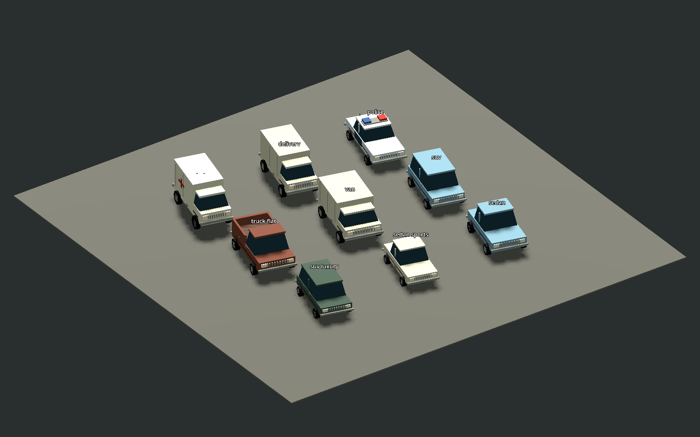

# Period land vehicles — 8 October 2026

Original stylised 1979–1982-inspired geometry replaces the generic land-vehicle
bodies through existing ModelLib consumers. These are fictional silhouettes,
not branded replicas: long-bonnet sedans/coupes, compact cars, squared utility
vehicles and wagons, pickups, panel vans and box-bodied service vehicles.

Muted blue, cream, green and rust-brown paint, steel wheels, chrome bumpers,
grilles, warm lamps and restrained fixed wear follow the Asset Bible direction.
Police, taxi and ambulance details remain legible without adding lights or
simulation state. Existing aircraft and boats are outside this batch.

Used model stems: sedan, sedan-sports, hatchback-sports, suv, suv-luxury, police,
taxi, van, delivery, ambulance, truck and truck-flat. Existing model IDs,
width/height/length envelopes, collision, prices, performance and ownership are
preserved. The old CC0 meshes remain the envelope source and fallback; this is
not removal of their shipped licence obligation.

Meshes/materials are cached and use one vertex-colour surface per LOD, without
textures. LOD transitions are at 55 and 180 metres; far visibility ends at 2500
metres and distant shadows are disabled. Tests enforce decreasing geometry,
under 5000 near triangles and under 1500 distant triangles, exact old envelopes,
ground-level wheels, no added collision and existing disabled-model behavior.

Measured per-instance triangles are 600–672 near, 284–344 middle and 172–232
far. These deliberately simple stylised bodies are below the Bible's ceilings;
they do not use extra geometry merely to reach a target budget.

## Rendering evidence

`tools/period_vehicle_preview.gd` renders the contact sheet.
`tools/vehicle_benchmark.gd` compares legacy and period bodies in the same
60-vehicle fleet, moving camera, lighting and 1280×720 Compatibility renderer.
Each run has 180 warmup and 360 sample frames. The desktop is an RX 7900 XT.

| First paired run | Legacy | Period |
|---|---:|---:|
| Mean frame interval (ms) | 0.3483 | 0.1359 |
| p95 frame interval (ms) | 0.533 | 0.203 |
| Static memory (bytes) | 155118215 | 154762560 |
| Last-frame draw calls | 670 | 116 |

Raw reports are `vehicle-legacy-2026-10-08.json` and
`vehicle-period-2026-10-08.json`. These short render-only desktop measurements
are not gameplay FPS or dense-combat evidence; they show no regression in this
fixture. Runtime driver/crew animation and authoritative damage presentation
are not implemented by the static asset batch.

## Acceptance still pending

Automated validation: full desktop suite **1059 passed, 0 failed** across shards
349/360/350, with no script/parse failures. Existing model integration tests
passed 4/4; the suite includes the two new envelope/LOD/cache tests. Isolated
1800-frame startup reported `SMOKE OK`; hygiene and staged whitespace checks
passed. Godot ObjectDB/resource/PagedAllocator shutdown cleanup diagnostics were
present and recorded separately from functional results.

Human driving and parking review, graphics-preset/LOD-transition review in the
world, exported Windows inspection and moving dense-combat performance remain
unperformed. Keep the batch draft until its stack and those visual checks are
reviewed. No new third-party assets or redistribution rights are introduced.
